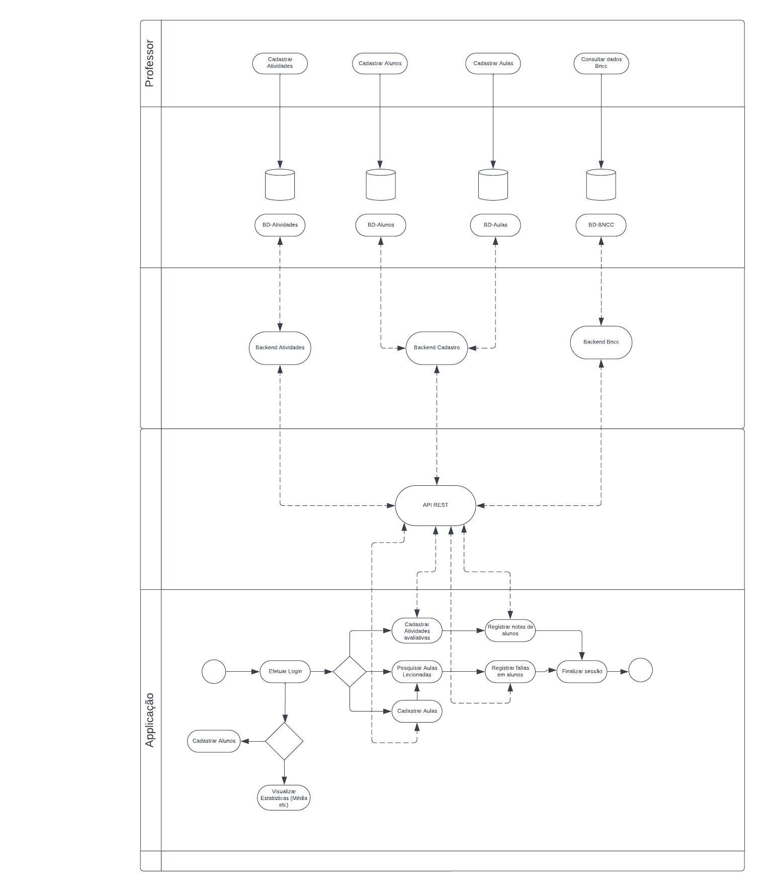
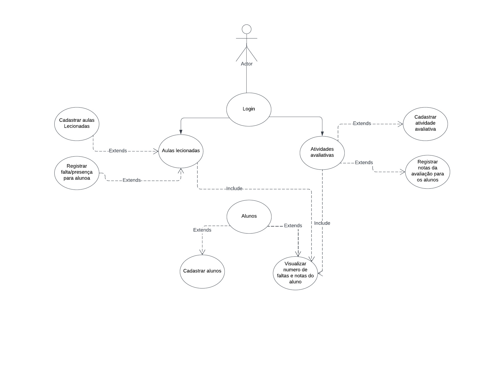

# Especificações do Projeto

## Personas

Segue o levantamento feito das personas e suas características durante o processo de entendimento do problema:

|    Persona    | Idade |           Ocupação           |                        Aplicativos                       |                      Motivações                     |                           Frustrações                          |                           Hobbies                          |
|:-------------:|:-----:|:---------------------------:|:--------------------------------------------------------:|:--------------------------------------------------:|:----------------------------------------------------------------:|:---------------------------------------------------------:|
| Ana Lúcia Santos  |   54  | Professora de Artes | WhatsApp, Facebook e Instagram.    | Promover excurções à museus de arte. | Não se sentir valorizada profissional e financeiramente. | Aprimorar o conhecimento na sua área de atuação. |
| Antonio Gamber  |   42  |  Professor de Matemática   | WhatsApp, Instagram, Linkedin e Aplicativos de Banco.           | Fazer uma especialização numa faculdade no exterior. | Ver que a média das notas dos alunos está baixa. | Ler sobre filosofia e ouvir música. |
| Viviana Gomes  | 31 |        Professora de Geografia          | WhatsApp, Facebook, Instagram e Tiktok.                          | Conseguir lecionar num curso de graduação. | Sentir que os alunos não mostram interesse por sua aula. | Praticar exercício físico e ler.
| Adélia Maria  |   47  | Professora de Espanhol | WhatsApp, Instagram e Youtube. | Especializar em mais dois idiomas. | Não ter recursos tecnológicos disponíveis em sala de aula. | Dançar e viajar. |
| Daniel Santos  |   37  |  Professor de Química   | WhatsApp, Aplicativo de compra e Youtube.  | Criar experimentos para atrair a atenção dos alunos.      | Lecionar poucas aulas no laboratório. | Assistir séries e jogar jogos online. |
| Denise Ornelas  |   44  |   Professora de História  | WhatsApp, Instagram e Facebook.                     | Fazer um grupo de estudo extra escolar para desenvolver temas referente à história do Brasil.      | Não gostar da abordagem dos livros escolhidos pelo mec. | Praticar natação e viajar. |

## Histórias de Usuários

Com base na análise das personas foram identificadas as seguintes histórias de usuários:

| EU COMO...       | QUERO/PRECISO ...             | PARA ...                                   |
|------------------|-------------------------------|--------------------------------------------|
| Ana Lúcia Santos | Obter uma visão ampla de todos os alunos e turmas     | Planejar melhor a modalidade de ensino e destinação dos professores de forma rápida e prática |
| Antônio Gamber   | Acompanhamento dos alunos e turmas                      | Obter visão do desempenho dos alunos e turmas durante o ano letivo vigente              |
| Viviane Gomes    | Visão de todos os itens relacionados à frequência dos alunos | Acompanhar em tempo real e garantir que o aluno está recebendo todas as informações internas repassadas diariamente |
| Adélia Maria     | Uma aplicação para controle do diário acadêmico         | Obter fácil acesso às informações acadêmicas dos alunos com segurança e estabilidade       |
| Daniel Santos    | Obter controle da disciplina lecionada e dos alunos da sala | Facilitar e identificar as dificuldades e necessidades de ajustes diários                  |
| Denise Ornelas   | Praticidade e simplicidade na localização das turmas     | Identificar os alunos de forma rápida e objetiva

## Modelagem do Processo de Negócio 

### Análise da Situação Atual

Os principais pontos da proposta é, em primeiro lugar, o processo de avaliação e frequência se refere às notas obtidas dos alunos durante o bimestre ou ano letivo, além de suas faltas. Nossa aplicação deve facilitar o trabalho do professor nesse sentido e permitir que o trabalho de lançamento de atividades, acompanhamento da nota dos estudantes em determinados períodos e sua presença seja registrada de forma rápida e efetiva. 

Em segundo lugar, os professores têm nos relatado dificuldades no que concerne ao registro das habilidades e conteúdos temáticos a serem trabalhados segundo à Base Nacional Curricular Comum (BRASIL, 2017). Trata-se de um documento norteador para a estrutura curricular que é adotada por todas as escolas do país, quer sejam públicas, quer particulares. Como a BNCC é um documento bastante extenso, de aproximadamente 600 páginas, os docentes têm a penosa tarefa de memorizar nomes para centenas de habilidades diferentes, pois o registro nos diários escolares é obrigatório desde a promulgação desse documento. Por essa razão, seria bastante bem-vindo um diário que permitisse o acesso automático à BNCC, de forma que as habilidades possam ser facilmente filtradas por bancos de dados e selecionadas em vez de buscadas exaustivamente em livros físicos.

### Descrição Geral da Proposta

Nossa proposta de aplicação visa a facilitar a vida dos docentes da Educação Básica no registro diário de suas atividades por meio de um novo diário eletrônico com acesso a documentos norteadores da educação do Ministério da Educação, como a BNCC. 

### Processo - Fluxo do App

O processo apresentado consiste no fluxo da aplicação e a estrutura usada

---

## Indicadores de Desempenho

Indicadores de desempenho para uma aplicação escalável

|Indicador|Objetivo|Descrição|Cálculo|Fonte de Dados|Perspectiva
|------|-----------------------------------------|----|----|----|----
|Tempo de carregamento da página|Medir o tempo de resposta|O tempo que a página leva para carregar é um dos indicadores mais importantes para evitar que os usuários abandonem o site||Banco de Dados|Cliente
|Nível de escalabilidade|Medir a escabilidade da ferramente|Avaliar a capacidade da aplicação de lidar com aumentos de tráfego||Aplicação|Cliente
|Taxa de retorno de usuários|Medir a satisfação do cliente|Avaliar quão satisfeitos estão os usuários com a aplicação||Aplicação|Cliente

## Requisitos

As tabelas que se seguem apresentam os requisitos funcionais e não funcionais que detalham o escopo do projeto. Para determinar a prioridade de requisitos, aplicar uma técnica de priorização de requisitos e detalhar como a técnica foi aplicada.

### Requisitos Funcionais

|ID    | Descrição do Requisito  | Prioridade |
|------|-----------------------------------------|----|
|RF-001| A aplicação deve ter uma tela de login e cadastro de usuário | BAIXA |
|RF-002| Permitir aos professores registrar informações sobre as aulas lecionadas, como data, disciplina, conteúdo abordado e materiais utilizados, e também cadastro de informações dos alunos, como nome, matrícula, contato, turma e outras informações relevantes | ALTA |
|RF-003| Permitir que os professores registrem a presença ou falta de alunos em cada aula   | MÉDIA |
|RF-004| Gerar relatórios de frequência e de notas para pais, responsáveis e gestores   | BAIXA |
|RF-005| Fornecer visualizações gráficas de médias de alunos, desempenho geral da turma e outras estatísticas relevantes   | BAIXA |
|RF-006| Permitir a busca de alunos por turma   | BAIXA |
|RF-007| Permitir o cadastro da turma  | BAIXA |

### Requisitos não Funcionais

|ID    | Descrição do Requisito  | Prioridade |
|------|-----------------------------------------|----|
|RNF-001| Garantir que o aplicativo seja acessível em diferentes dispositivos, como smartphones, tablets e computadores.   | MÉDIA |
|RNF-002| Tempo de resposta aceitável, até 5 segundos, para as ações do usuário, como carregamento de páginas, processamento de dados e requisições na API. | MÉDIA |

## Restrições

O projeto está restrito pelos itens apresentados na tabela a seguir.

|ID| Restrição                                             |
|--|-------------------------------------------------------|
|01| O projeto deverá ser entregue até o final do semestre na data 10/12/2023 |
|02| O banco de dados deve ser hospedado na nuvem para acesso da aplicação |
|03| O desenvolvimento da aplicação Web/Mobile deve ser desenvolvida pelo Time atual |

## Diagrama de Casos de Uso

Na imagem abaixo é apresentado o diagrama de casos de uso do projeto.

---
# Matriz de Rastreabilidade

|      |RF-001|RF-002|RF-003|RF-004|RF-005|RF-006|RF-007|RNF-001
|------|-|-|-|-|-|-|-|-|
|RF-001||
X
|
X
|
X
|
X
|
X
|
X
|
X

|RF-002|||
X
|
X
|
X
|
X
|
X
|
X

|RF-003||
X
|||||
X
|
X

|RF-004||
X
|
X
||||
X
|
X

|RF-005||
X
|
X
||||
X
|
X

|RF-006||
X
|||||
X
|
X

|RF-007||||||||
X

|RNF-001|
X
|||||||

# Gerenciamento de Projeto

### Gerenciamento de Tempo

[Kanban da equipe](https://github.com/orgs/ICEI-PUC-Minas-PMV-ADS/projects/560)

### Gerenciamento de Equipe
O gerenciamento adequado de tarefas contribuirá para que o projeto alcance altos níveis de produtividade. Por isso, é fundamental que ocorra a gestão de tarefas e de pessoas, de modo que os times envolvidos no projeto possam ser facilmente gerenciados. 

|                  | Agosto                | Setembro              | Outubro               | Novembro              |
|------------------|-----------------------|-----------------------|-----------------------|-----------------------|
| **Data de Entrega**  | 01/08/23 a 03/09/23   | 04/09/23 a 01/10/23   | 02/10/23 a 29/10/23   | 30/10/23 a 26/11/23   |
| **Equipe de Gestão** | **Documento de Contexto** |                       |                       |                       |
| **Equipe Back**      |                       | **Implementação da API** |                       |                       |
| **Equipe Front**    |                       |                       | **Projeto e implementação da interface Web** | **Projeto e implementação da interface Mobile** |

## Gestão de Orçamento

O processo de determinar o orçamento do projeto é uma tarefa que depende, além dos produtos (saídas) dos processos anteriores do gerenciamento de custos, também de produtos oferecidos por outros processos de gerenciamento, como o escopo e o tempo.

