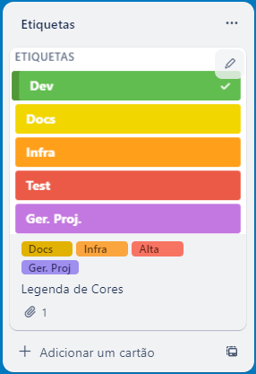

# Metodologia

## Relação de Ambientes de Trabalho

---

| Ambiente                          | Plataforma | Link de acesso                                                                                                          |
| --------------------------------- | ---------- | ----------------------------------------------------------------------------------------------------------------------- |
| Repositório de código fonte       | Github     |https://github.com/ICEI-PUC-Minas-PMV-ADS/pmv-ads-2023-2-e4-aplicdistrib-t5-pmv-ads-2023-2-e4-g5-diario-t5                |
| Documentos do projeto             | Github     | https://github.com/ICEI-PUC-Minas-PMV-ADS/pmv-ads-2023-2-e4-aplicdistrib-t5-pmv-ads-2023-2-e4-g5-diario-t5/tree/main/docs |
| Projeto de Interface e Wireframes | A definir  | A definir                                                                                          |
| Gerenciamento do Projeto          | Trello     | https://trello.com/b/8lJOQrrJ/projeto-eixo-4                                                                               |

---

## Controle de Versão

A ferramenta de controle de versão adotada no projeto foi o
[Git](https://git-scm.com/), sendo que o [Github](https://github.com)
foi utilizado para hospedagem do repositório.

---

---
## Gerenciamento de Projeto

### Divisão de Papéis

Nossa equipe utiliza metodologias ágeis, tendo escolhido o Scrum como base para definição do processo de desenvolvimento.

A equipe está organizada da seguinte maneira:

* Scrum Master:
  - `Gustavo Alves Oliveira`
* PO:
  -  `José Carlos da Costa Júnior`
* Equipe de Desenvolvimento Front End:
  -  `Gustavo Alves Oliveira`
  - `Jefferson Filho`
  - `Alexandre Magalhães Ribeiro`
  - `Crislaine Fernandes Silva Medeiros`
* Equipe de Desenvolvimento Back end:
  - `José Carlos da Costa Júnior`
  -  `Gustavo Alves Oliveira`
### Processo

Para organização e distribuição das tarefas do projeto, a equipe utiliza o Trello, o qual é estruturado com as seguintes listas: 
-	<b>Backlog</b>: Recebe as tarefas a serem trabalhadas e representa o Product Backlog. Todas as atividades identificadas no decorrer do projeto também vão ser incorporadas a esta lista.

-  <b>Ready for dev</b>: Esta lista detalha os cards prontos para ser desenvolvidos

-	<b>A Fazer</b>: Esta lista representa o Sprint Backlog. Este é o Sprint atual que estamos trabalhando.

-	<b>Em andamento</b>: Quando uma tarefa tiver sido iniciada, ela é movida para cá.

-	<b>Concluído</b>: Nesta lista são colocadas as tarefas que passaram pelos testes e controle de qualidade e estão prontos para ser entregues ao usuário.

O quadro kanban do grupo no Trello está disponível através da URL: https://github.com/orgs/ICEI-PUC-Minas-PMV-ADS/projects/560/views/2 e é apresentado na imagem abaixo.

---
As tarefas são etiquetadas em função da natureza da atividade e seguem o seguinte esquema de cores/categorias:
-	Desenvolvimento 
-	Documentação                                 
-	Infraestrutura
-	Testes
-	Gerência de Projetos.

### Ferramentas

As ferramentas empregadas no projeto são:

- Editor de código.
  - `Visual studio Code`
- Ferramentas de comunicação
  - `Trello`
  - `Teams`
- Ferramentas de desenho de tela (_wireframing_)
  - `A definir`

O editor de código foi escolhido pela facilidade de utilização e familiaridade dos desenvolvedores com o mesmo.

- Github
  - `Auxiliará no controle de versão da applicação`
- Trello
  - `Auxiliará na gestão dos requisitos/backlog`
- Microsoft Teams
  - `Auxiliará na comunicação do time `
 
---
