# Arquitetura da Solução

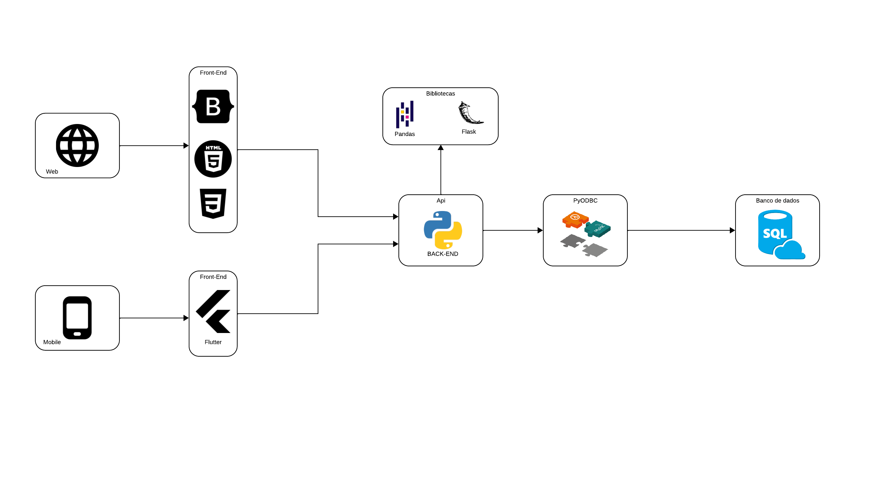

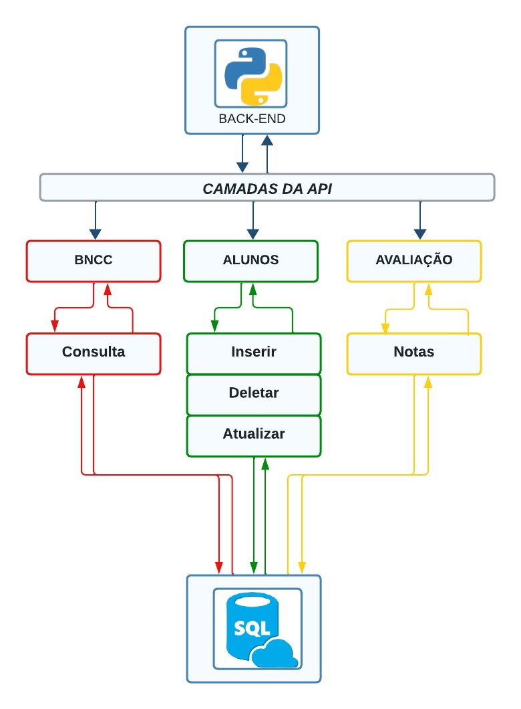

A base de nossa aplicação, tanto para web quanto para mobile, consiste na manipulação de um banco de dados SQL, acessado por meio de APIs diferentes, mas complementares. Vamos denominá-las de API BNCC, Alunos e Avaliação e explicitar suas funções a seguir. 

A API BNCC acessa as habilidades e outras informações do banco de dados da BNCC e que devem ser registradas no diário eletrônico. Trata-se de uma api com diversos métodos GET que filtram os vários componentes curriculares, habilidades e conteúdos a serem trabalhados, obrigatoriamente, em sala de aula.

Já a API ALUNOS permite o acessar, editar, inserir e excluir alunos, atividades, notas e frequência dos discentes. Dessa forma, uma atividade avaliativa registrada pelo professor em sala de aula vai utilizar essas duas APIs e fazer o registro em uma tabela SQL com a junção de ambas. 

Isso significa que, quando o professor digitar o nome e nota de uma atividade, vai acessar a API ALUNOS, enquanto que, quando escolher em um menu a habilidade ou conteúdo trabalhados, vai acessar a API BNCC, e salvar os dados gerados em uma tabela só no SQL.
Dessa forma, temos:
1) Usuário acessa APIs hospedadas na nuvem, cada qual com sua função
2) Registros e edições do usuário são salvos pela API e aplicados no banco de dados

## Diagrama de Classes

O diagrama de classes ilustra graficamente como será a estrutura do software, e como cada uma das classes da sua estrutura estarão interligadas. Essas classes servem de modelo para materializar os objetos que executarão na memória.

## Modelo ER
Abaixo é possivel ver o modelo ER da aplicação

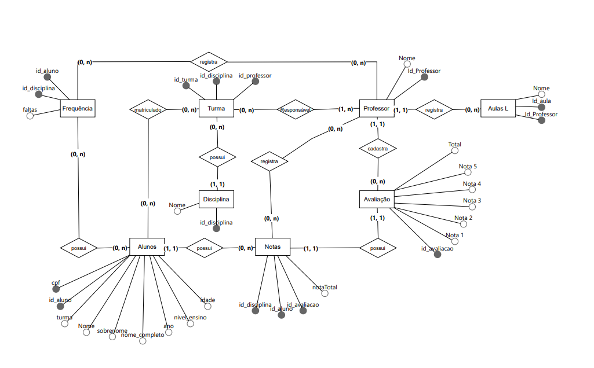

## Esquema Relacional

O Esquema Relacional corresponde à representação dos dados em tabelas juntamente com as restrições de integridade e chave primária.
 
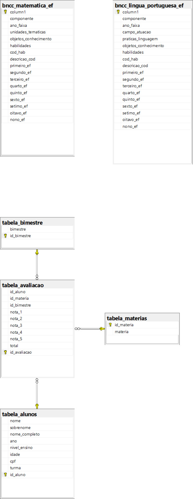

## Modelo Físico

O modelo físico do banco de dados se encontra na pasta src/ApiPython/bd/bd_diario_script.sql e contém os scripts utilizados na criação do banco de dados e das tabelas.

## Tecnologias Utilizadas

Para sua construção das APIs, tem sido utilizada a linguagem Python, juntamente com a biblioteca Flask e Pandas, além de PyODBC, que integra o SQL no Python. A justificativa para utilizar Python se deve a seu poder de manipulação de dados e demanda extremamente grande de expressões regulares para pesquisa e extração de dados da BNCC, que não tem um banco de dados tal como disponibilizado neste trabalho. No extensivo trabalho para construção do banco de dados da BNCC, por exemplo, foi bastante utilizada a biblioteca re, de expressões regulares do Python, juntamente com filtragens em conjunto com o Pandas, sem os quais esse trabalho não seria possível. 
As linguagens de front end estão sendo analisadas. A princípio, vamos utilizar HTML, CSS, Bootstrap e JavaScript para a versão Web e Flutter ou React Native para a versão mobile. 

##Documentação da api
O projeto usa como base 2 apis até o momento. A primeira permite fazer crud de estudantes no banco de dados, enquanto a segunda permite o acesso às orientações curriculares na BNCC. Ambas consultam e executam diversas operações em um mesmo banco de dados criado em SQL (SQL Server), a ser subido para nuvem em momento oportuno. Ambas as apis estão documentadas no Swagger (api/docs/#swagger) e foram construídas usando o framework Flask em linguagem Python. A api de alunos tem a seguinte estrutura, com métodos GET, PUT, DELETE e POST:
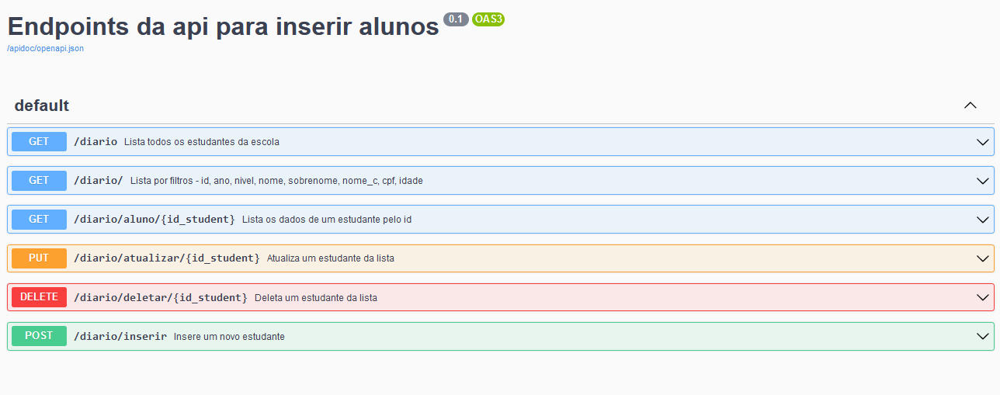

Abaixo, um exemplo de busca baseado no id do estudante, que é feito via path:
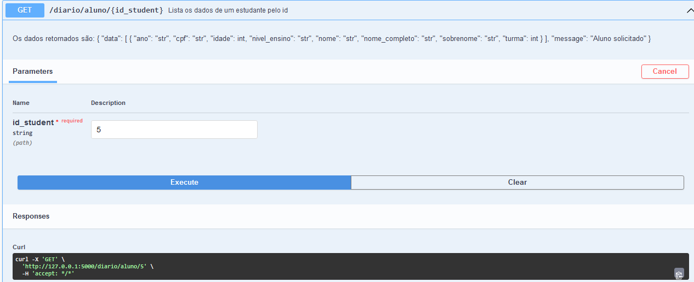

A seguir, um exemplo de como estão documentados os métodos das querystrings:

A api da BNCC está constituída por diversos métodos GETs diferentes, visto que é uma api de consulta. Isso se deve ao fato de a BNCC ser um documento oficial orientador do currículo. Dessa forma, é visível a necessidade apenas de visualizações, já que não será possível apagar ou editar um documento oficial. É possível visualizar sua estrutura na imagem abaixo:
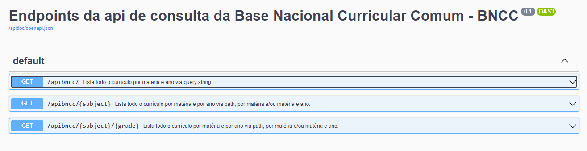
Também é possível visualizar que todos os métodos estão documentados e é possível visualizar também todos os parâmetros, tanto passados por path quanto por querystring, para fazer diversas filtragens. 

Na imagem a seguir, passados os parâmetros especificados, que são matéria e ano, todo o conteúdo curricular referente a isso será visualizado.
 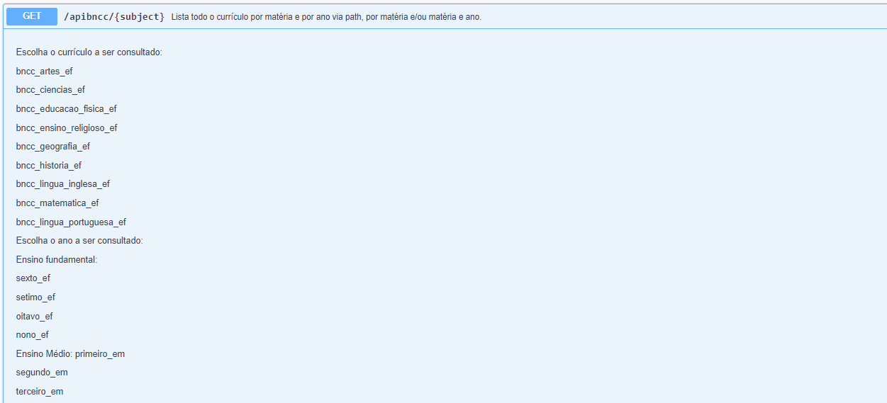
 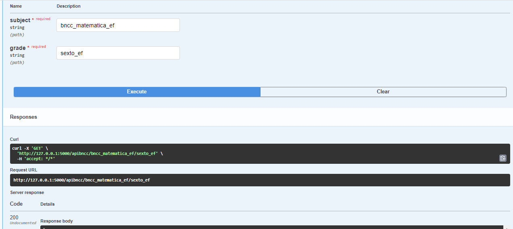
 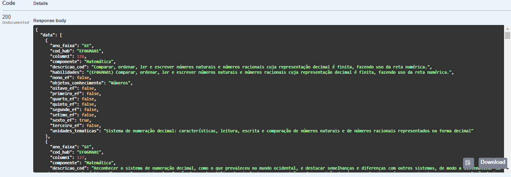
## Estilo Arquitetural do Projeto
No projeto utilizaremos o DDD no C# para o consumo e tratamento dos dados que virão da API desenvolvida em python.

No backend da api (Python) utilizaremos a arquitetura de microserviços.

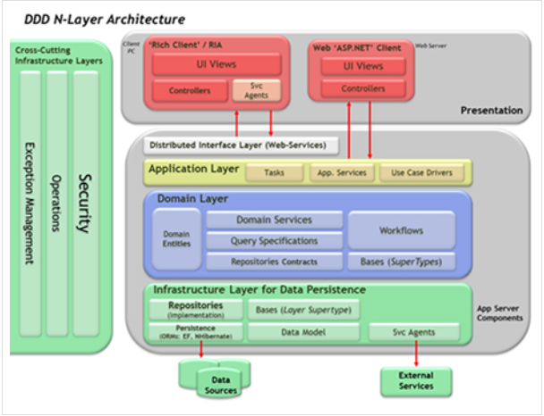

Neste projeto vamos usar o padrão arquitetural DDD (Domain-Driven-Design) para o consumo da api e o front-end Web.

A escolha de adotar o padrão arquitetural Domain-Driven Design (DDD) em nosso projeto é fundamentada em várias razões essenciais:

1 - **Representação Precisa do Domínio:** DDD nos permite modelar nosso domínio de negócios de forma precisa no software, garantindo que nossas estruturas e lógicas reflitam fielmente as complexidades do nosso campo de atuação.

2 - **Orientação ao Negócio:** Com DDD, nosso foco principal é alinhar o software às necessidades reais do negócio e dos usuários. Isso assegura que nosso projeto seja centrado nas demandas do mercado e nas expectativas dos clientes.

3 - **Arquitetura Flexível e Adaptável:** DDD promove uma arquitetura modular que facilita a expansão e evolução do sistema à medida que nossos requisitos e o domínio de negócios mudam. Isso garante que o software seja duradouro e resiliente.

Portanto, a adoção do padrão arquitetural DDD para o consumo da api e tratamento de dados em nosso projeto visa criar uma solução robusta, orientada ao negócio e adaptável às mudanças futuras.

Já na parte da api utilizaremos uma arquitetura de microserviços em python

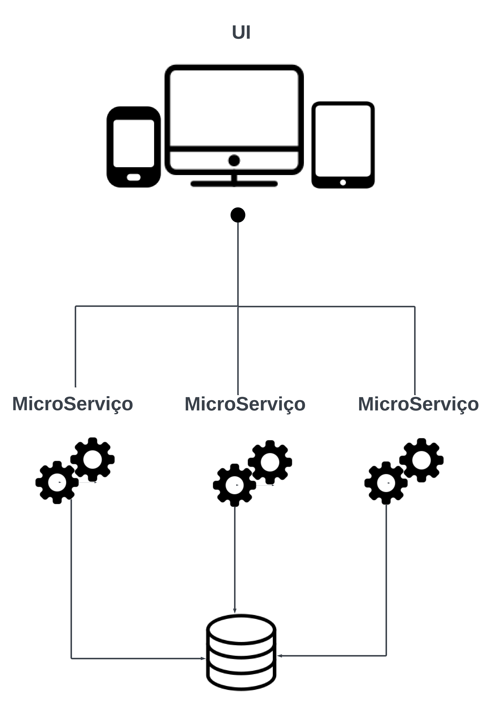

A escolha de adotar uma arquitetura de microserviços em nosso projeto é fundamentada em 3 razões.

1 - **Escalabilidade Sob Demanda:**

Imagine que o diário eletrônico cresce ao longo do tempo, com mais professores e alunos usando o sistema. Com uma arquitetura de microserviços, cada funcionalidade, como registro de aulas, notas e presença, pode ser tratada por um microserviço separado. Isso significa que, se uma parte do sistema se tornar mais exigente em termos de recursos, você pode dimensioná-la independentemente, garantindo que o sistema continue funcionando de maneira eficiente e rápida.

2 - **Desenvolvimento e Manutenção Eficiente:**

Com microserviços, diferentes equipes podem se concentrar em áreas específicas do diário eletrônico. Por exemplo, uma equipe pode cuidar do registro de presença, enquanto outra trabalha nas notas dos alunos. Isso torna o desenvolvimento mais ágil, pois as equipes podem trabalhar simultaneamente e lançar atualizações mais rapidamente. Além disso, quando há necessidade de correções ou melhorias, é mais fácil fazer isso em um microserviço específico, sem afetar outras partes do sistema.

3 - **Resiliência e Tolerância a Falhas:**

Em um ambiente educacional, a confiabilidade do sistema é fundamental. Com microserviços, se um componente, como o registro de notas, enfrentar problemas técnicos, as outras funcionalidades, como o registro de aulas, ainda podem funcionar. Isso evita interrupções completas do sistema. Além disso, você pode implementar estratégias de recuperação específicas para cada microserviço, garantindo que problemas isolados possam ser resolvidos de forma rápida e eficaz.

## Hospedagem

A hospedagem dos bancos de dados e aplicação pode ser feita pelo https://smarterapp.com.br/Login.aspx ou https://planetscale.com/. Estamos estudando as opções disponíveis e fazendo testes. 

## Qualidade de Software

Conceituar qualidade de fato é uma tarefa complexa, mas ela pode ser vista como um método gerencial que através de procedimentos disseminados por toda a organização, busca garantir um produto final que satisfaça às expectativas dos stakeholders.

No contexto de desenvolvimento de software, qualidade pode ser entendida como um conjunto de características a serem satisfeitas, de modo que o produto de software atenda às necessidades de seus usuários. Entretanto, tal nível de satisfação nem sempre é alcançado de forma espontânea, devendo ser continuamente construído. Assim, a qualidade do produto depende fortemente do seu respectivo processo de desenvolvimento.

A norma internacional ISO/IEC 25010, que é uma atualização da ISO/IEC 9126, define oito características e 30 subcaracterísticas de qualidade para produtos de software.
Com base nessas características e nas respectivas sub-características, identifique as sub-características que sua equipe utilizará como base para nortear o desenvolvimento do projeto de software considerando-se alguns aspectos simples de qualidade. Justifique as subcaracterísticas escolhidas pelo time e elenque as métricas que permitirão a equipe avaliar os objetos de interesse.

> **Links Úteis**:
>
> - [ISO/IEC 25010:2011 - Systems and software engineering — Systems and software Quality Requirements and Evaluation (SQuaRE) — System and software quality models](https://www.iso.org/standard/35733.html/)
> - [Análise sobre a ISO 9126 – NBR 13596](https://www.tiespecialistas.com.br/analise-sobre-iso-9126-nbr-13596/)
> - [Qualidade de Software - Engenharia de Software 29](https://www.devmedia.com.br/qualidade-de-software-engenharia-de-software-29/18209/)

[def]: image.png