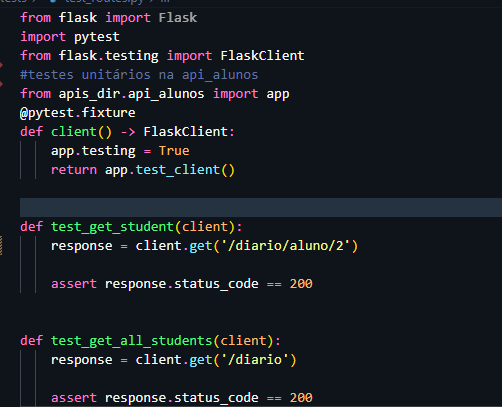
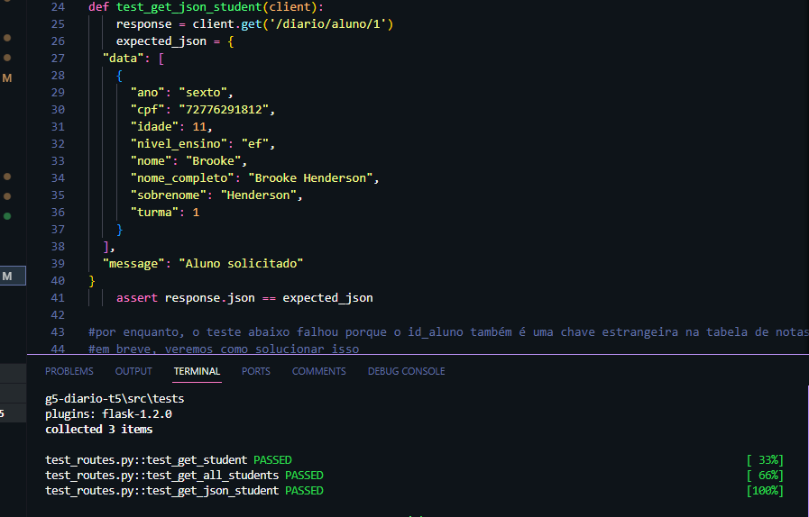

## Testes unitários da aplicação
Foram realizados alguns testes unitários utilizando o pytest e o Flask testing do Python. Isso permite verificar se, de fato, o código funciona conforme o esperado sem a necessidade de conexão em um banco de dados onine. Os arquivos estão armazenados na pasta tests. 
Abaixo, por exemplo, são realizados três testes.  O primeiro testa se a busca por estudante via id vai de fato retornar um objeto, enquanto o segundo verifica se todos os estudantes vão ser listados pela rota /diario. Já o terceiro analisa se, de fato, a estrutura mencionada no Json de retorno é a passada.Todos esses testes passaram. 

Outros testes, tais como para inserir e apagar alunos, estão sendo implementados. Um deles, para deletar aluno pelo id, não passou, pois id_aluno é chave-estrangeira da tabela_avaliação do banco de dados. Ainda verificaremos como resolver esse problema. 
